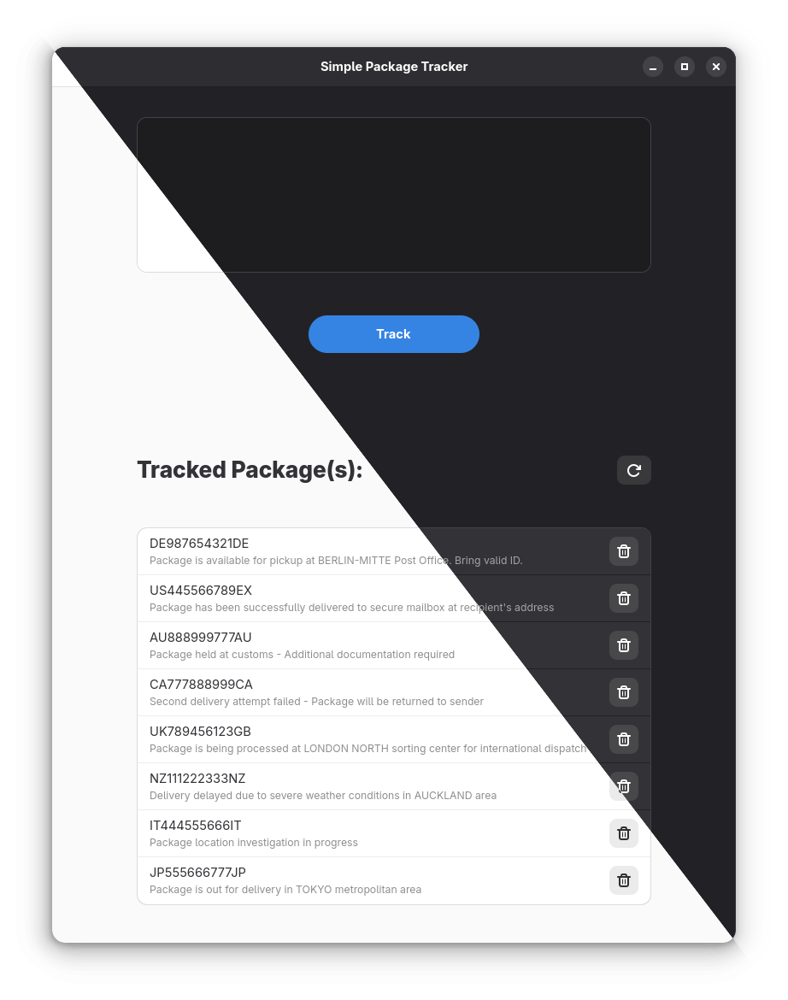
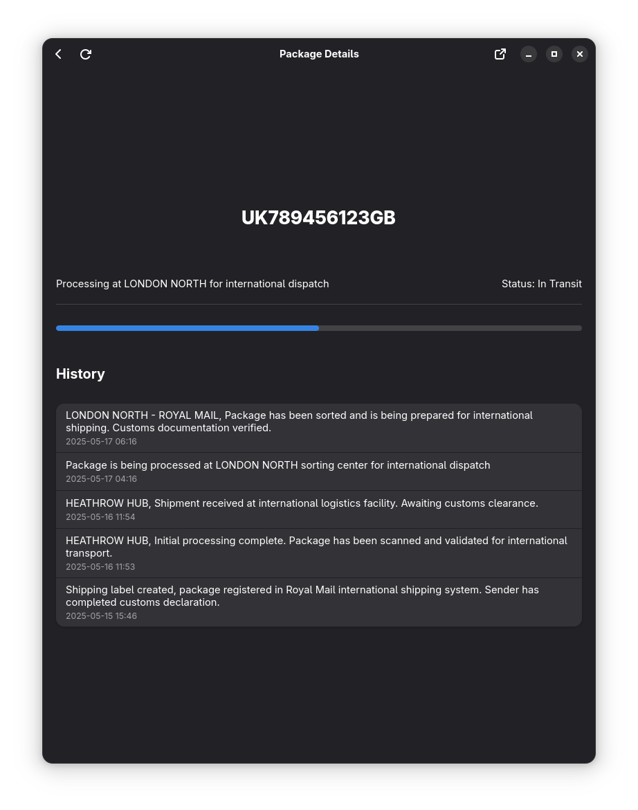

# Simple Package Tracker

Home Page                    |  Details Page
:-------------------------:|:-------------------------:
  |  

A modern package tracking application built with Rust and libadwaita

## About

This project was created as a learning experience to explore:
- 🦀 Rust programming language
- 🎨 libadwaita for modern GTK applications
- 📦 Flatpak packaging and distribution
- 🔌 Integration with the Ship24 API

## Features

- 📱 Modern, adaptive UI with libadwaita
- 🌓 Dark/Light mode support
- 📦 Track multiple packages simultaneously
- 🔍 Detailed package information and status updates
- 🎯 Simple and intuitive interface

## Development

### Prerequisites

- Rust toolchain
- GTK development libraries
- Flatpak development tools

### Building from Source

1. Clone the repository:
```bash
git clone https://github.com/suntyx/simple-package-tracker.git
cd simple-package-tracker
```

2. Build the project:
```bash
cargo build
```

3. Run the application:
```bash
cargo run
```

### Flatpak Development

You can either:

1. Build and install from source:
```bash
flatpak-builder --user --install build-dir flatpak/manifest.json
```

2. Or install directly from the Flatpak reference file in the [releases](https://github.com/4lrick/simple-package-tracker/releases):
```bash
flatpak install --user simple-package-tracker.flatpak
```

To uninstall:
```bash
flatpak uninstall io.github.alrick.simple_package_tracker
```

## License

This project is licensed under the [GNU General Public License v3.0](LICENSE.txt).

## Acknowledgments

- [libadwaita](https://gitlab.gnome.org/GNOME/libadwaita) for the beautiful UI components
- [Ship24](https://www.ship24.com/) for the package tracking API